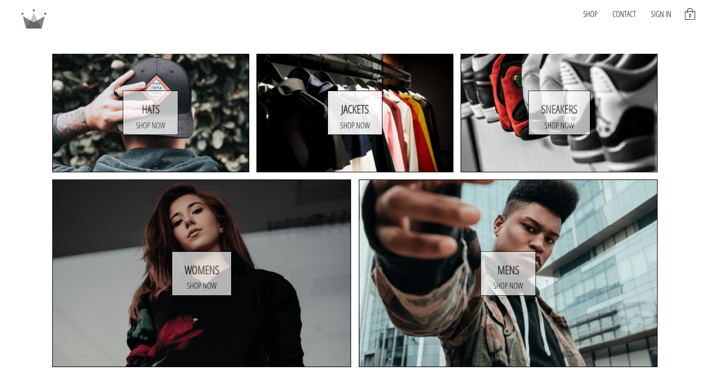

# Crown Clothing

Crown clothing is an e-commerce website that allows users to register an account and sign-in, with Google user-authentication included. The user is able to store items into their cart, go to checkout, specify the quantity of each item, delete items from the cart. 

## Technologies Used
* **React** and **Redux** for front-end development
* **React Router** for website navigation
* **Stripe API** for user-payments
* **Firebase** for user-authentication and database
* **SCSS** for stylization

## How to use
The site can be found [here](https://haipa-crwn-clothing.herokuapp.com/). You can register an account or sign-in with your Google account. If you've registered with the site, you can sign in. From there you can navigate the site, add items to your cart, and go to checkout to purchase your items

**Note: The site is for project purposes only and will not accept any payments at checkout. There is a test credit card provided to test the Stripe payment functionality.**

If you sign out and log back in, or close the site and reopen it, you will still maintain the items in your cart.

***The project is still a work-in-progress, with the hosted website showcasing the main functions of the site.***

